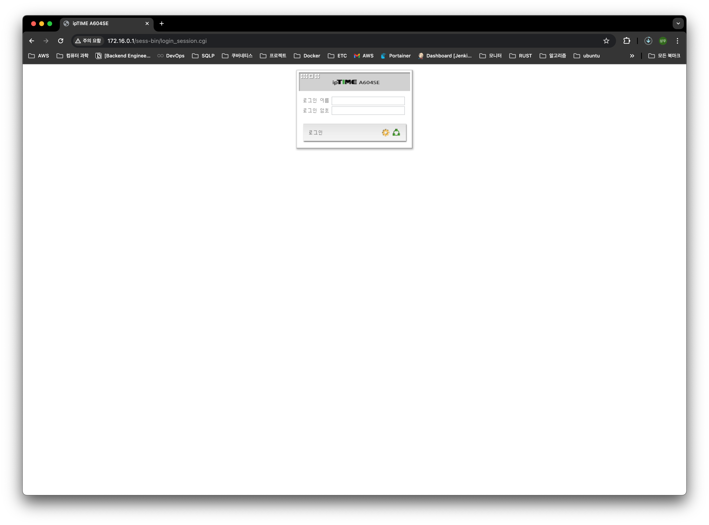
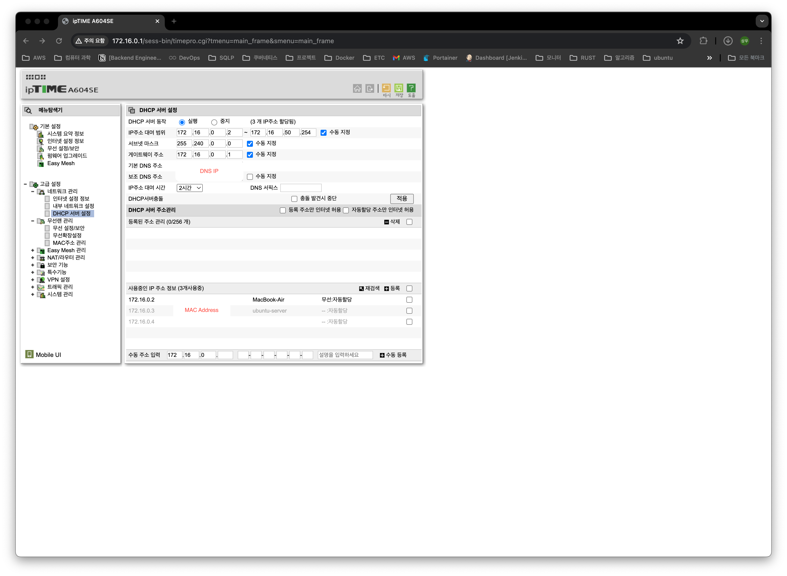
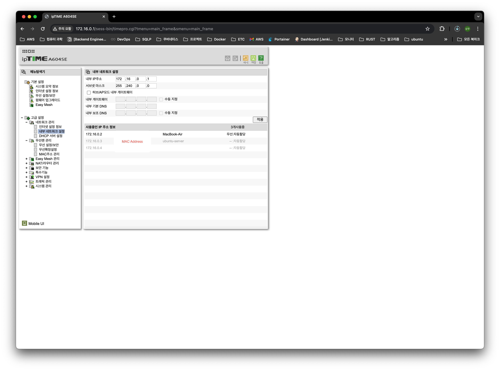

일반 가정집의 네트워크를 보면 `192.168.0.1/16`번 대역이 기본값이다.

당장은 노트북 하나로 서버를 돌리고 있지만, 나중에 데스크탑 추가하고 여러 실습하다 보면 IP가 많이 필요할 수도 있다는 생각이 들었다.

공유기는 *IPtime A604SE*을 사용하고 있다.

1. 브라우저에 `192.168.0.1`를 입력한다.

2. 로그인한다.  

3. `고급 설정` - `네트워크 관리` - `DHCP 설정`으로 이동한다.
4. 사용하려는 IP 대역 & 서브넷 마스크 & 게이트웨이 주소를 잘 입력한다.

5. `고급 설정` - `네트워크 관리` - `내부 네트워크 설정`으로 이동한다.
6. 아까 설정한 내트워크의 **게이트웨이 주소**와 **서브넷 마스크**를 순차적으로 누르고 적용을 누른다.

이렇게 하더라도 공유기가 한 대이기에 하나의 네트워크만 사용할 수 있다.  
그렇지만 `192.168.0.2` ~ `192.16.0.254`에서 쓸 수 있던 노드(ip)의 개수는 엄청나게 늘어나게 된다.