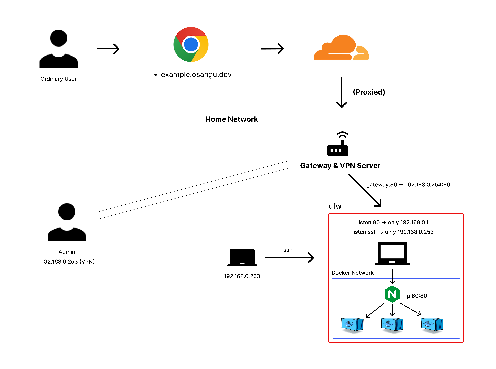

홈 서버에 관해 여러 글들을 접하다보니 하나 장만하면 좋겠다는 생각이 들었다. 가장 독보적인 장점은 비용이다.
서버리스까지 생각하지 않을 수 있을 만큼, 부담해야하는 가격이 적다.

비용 걱정 없이 프로젝트를 할 수 있고 학습에 사용할 수 있다.
물론 홈 서버를 구성하면서도 배울 것이 많다고 생각했고, 많이 배우는 중이다.

아래와 같은 순서들로 todo를 해가며 진행중이다.

- [ ]  Ubuntu Server 설치
> ! cat /sys/block/sdb1/removable: No such file or directory       
> !  Reboot and Select proper Boot device or Insert Boot Media in selected Boot device and press a key  
> ! [Difference between hard disk and UEFI hard disk](https://www.reddit.com/r/LinusTechTips/comments/svm72w/difference_between_uefi_hard_disk_and_hard_disk/)
- [ ] 공유기 설정
> - ip 대역 바꾸기  
> - 정적 ip 할당하기
- [ ] Battery Guard 설정 (과충전으로 인한 화재 예방..)
- [ ] Docker 설치
- [ ] 도메인 구매
- [ ] Let's Encrypt 발급
- [ ] Docker Swarm -> k8s 단일 노드 -> k8s 멀티 노드(데스크탑, 라즈베리 추가)

아 그리고 노트북에서 하다 보니, 생각지도 못 한 장단점들이 있었다.  
[노트북을 홈서버로 사용할 때 장단점]() 꼭 읽어보기 바란다.
